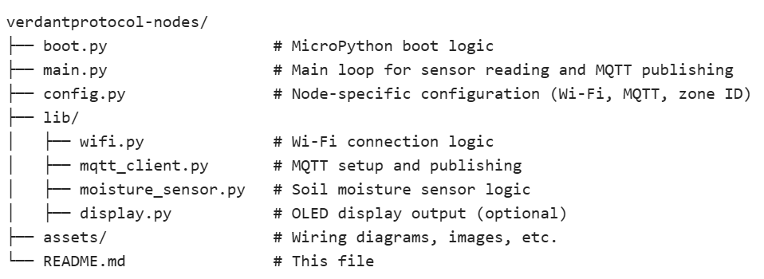

# 🌿 VerdantProtocol Nodes

This repository is part of the broader [VerdantProtocol](https://github.com/ddbloth/verdantprotocol-core, and intelligent environmental monitoring and automation framework for grow tents, greenhouses, and beyond.

---

## 📦 Purpose of This Repository

**`verdantprotocol-nodes`** contains the firmware and configuration logic for the distributed sensor nodes in the VerdantProtocol network. These nodes are built using Raspberry Pi Pico W microcontrollers and are responsible for collecting environmental data and publishing it to the master controller via MQTT.

Each node is modular and may include one or more sensors such as:

- 🌱 Soil moisture
- 🌡️ Temperature and humidity
- 🌬️ Barometric pressure
- 💡 Ambient light
- 🧪 pH and EC sensors
- 🌫️ CO₂ and air quality

---

## 🧱 Folder Structure

